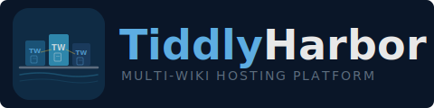

<p align="center">
  
</p>

# TiddlyHarbor

A self-hosted multi-wiki platform built on [TiddlyWiki](https://tiddlywiki.com), with a management console, Caddy reverse proxy, OAuth login, git-backed autosave, and per-wiki user management.

## Features

- **Management Console** — Web UI for adding, editing, and removing wikis, with live container status and one-click config apply
- **Multi-site hosting** — Run any number of TiddlyWiki instances from a single server, each with its own path or domain
- **User management** — Per-wiki admin page for creating users, assigning roles, setting emails, and managing access
- **Invite & password reset** — Email-based user invites and forgot-password flow (when SMTP is configured)
- **OAuth login** — GitHub and Google sign-in, configurable per wiki
- **Git autosave** — Write-triggered commits with quiescence and max-interval timers, optional push to remote
- **Clone from remote** — Wikis can clone from a git repo on first start, with configurable branch
- **Public read / writer login** — Anonymous visitors get read-only access; write operations require authentication
- **Tiddler import** — Upload an HTML TiddlyWiki file when creating a wiki to import its tiddlers
- **HTTPS** — Caddy handles automatic TLS certificate provisioning via Let's Encrypt

## Quick Start

1. Copy and edit the environment file:

   ```bash
   cp .env.example .env
   # Edit .env with your credentials
   ```

2. Generate routing and compose files:

   ```bash
   node scripts/generate-config.js
   ```

3. Start the stack:

   ```bash
   docker compose up --build
   ```

4. Open:
   - Wiki: http://localhost/main/
   - Console: http://localhost/_console/

## Management Console

The console is a web UI at `/_console/` for managing your TiddlyHarbor instance. It is protected by basic auth (set `CONSOLE_USER` and `CONSOLE_PASS` in `.env`).

From the console you can:

- **View the dashboard** — See all wikis with live running/stopped status indicators
- **Add a wiki** — Set name, path, domain, git repo, branch, auth credentials, and per-wiki options; optionally upload an HTML file to import tiddlers
- **Edit a wiki** — Modify any configuration field for an existing wiki
- **Remove a wiki** — Delete a wiki from the config, with optional data volume deletion
- **Apply changes** — Regenerate `docker-compose.yml` and `Caddyfile`, then run `docker compose up` to bring new containers online

Changes are auto-applied when you add, edit, or remove a wiki. The dashboard shows whether configuration is up to date with the running containers.

## Per-Wiki Admin

Each wiki has an admin page at `/<wiki>/admin` (accessible to users with the `admin` role) where you can:

- Create users (with password or email invite)
- Change roles (`reader`, `writer`, `admin`)
- Enable/disable accounts
- Reset passwords
- Set user emails
- Delete users

When SMTP is configured, creating a user with an email but no password sends an invite link. The login page also shows a "Forgot password?" link for self-service resets.

All admin actions are logged as structured `[ADMIN_AUDIT]` events in container logs.

## Project Layout

```
TiddlyHarbor/
  config/
    sites.yml             # Wiki definitions and defaults
  console/
    server.js             # Management console Express app
    lib/
      config.js           # sites.yml read/write
      docker.js           # Container status and compose operations
      pages.js            # Console page rendering
  scripts/
    generate-config.js    # Generates docker-compose.yml and Caddyfile
    manage-sites.js       # CLI for site management
  wiki-container/
    server.js             # Per-wiki Express app (auth, proxy, git)
    lib/
      auth-pages.js       # Login, admin, invite, and reset pages
      git-sync.js         # Git autosave engine
      notifications.js    # SMTP email (invites, resets, admin alerts)
      oauth-config.js     # OAuth provider filtering
      oauth-strategies.js # Passport GitHub/Google strategies
      user-store.js       # SQLite user database
      write-guard.js      # Write-operation auth middleware
      writer-session.js   # Session cookie management
  Caddyfile               # Generated — reverse proxy config
  docker-compose.yml      # Generated — service definitions
  .env.example            # Template for environment variables
```

## Power Users

### Site Management CLI

The `manage-sites.js` script provides command-line wiki management as an alternative to the console:

```bash
# List configured wikis
npm run manage list

# Add a wiki
npm run manage add my-wiki --domain=my-wiki.example.com
npm run manage add my-wiki --path=/my-wiki --repo=https://TOKEN@github.com/org/repo.git

# Remove a wiki
npm run manage remove my-wiki
```

After CLI changes, regenerate and restart:

```bash
node scripts/generate-config.js
docker compose up -d --build
```

### User Admin CLI

Run user commands inside a wiki container:

```bash
docker compose exec wiki-main node scripts/user-admin.js list
docker compose exec wiki-main node scripts/user-admin.js create alice StrongPass123 writer
docker compose exec wiki-main node scripts/user-admin.js set-password alice NewPass456
docker compose exec wiki-main node scripts/user-admin.js set-role alice admin
docker compose exec wiki-main node scripts/user-admin.js disable alice
docker compose exec wiki-main node scripts/user-admin.js enable alice
docker compose exec wiki-main node scripts/user-admin.js delete alice
```

### Admin REST API

Authenticated `admin` sessions can manage users via HTTP:

```bash
# List users
curl -s -b cookie.txt http://localhost/main/auth/users

# Create user
curl -s -b cookie.txt -X POST http://localhost/main/auth/users \
  -H "Content-Type: application/json" \
  -d '{"username":"bob","password":"StrongPass123","role":"writer"}'

# Change role / toggle active / reset password / delete
curl -s -b cookie.txt -X PATCH http://localhost/main/auth/users/bob/role -H "Content-Type: application/json" -d '{"role":"admin"}'
curl -s -b cookie.txt -X PATCH http://localhost/main/auth/users/bob/active -H "Content-Type: application/json" -d '{"isActive":false}'
curl -s -b cookie.txt -X PATCH http://localhost/main/auth/users/bob/password -H "Content-Type: application/json" -d '{"password":"NewPass456"}'
curl -s -b cookie.txt -X DELETE http://localhost/main/auth/users/bob
```

## Documentation

See [Production Deployment Guide](docs/PRODUCTION-DEPLOYMENT.md) for full setup instructions including DNS, OAuth, SMTP, and HTTPS configuration.
